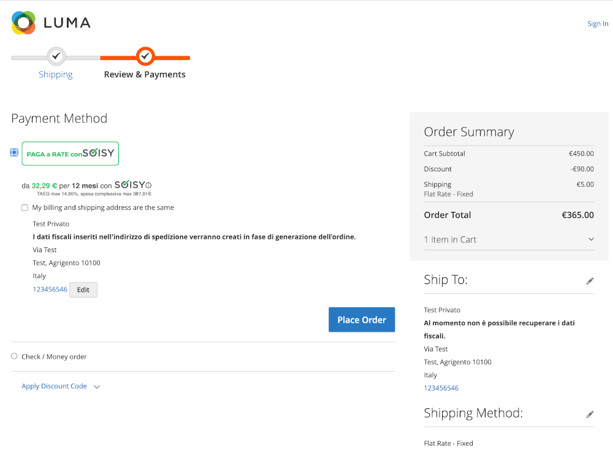
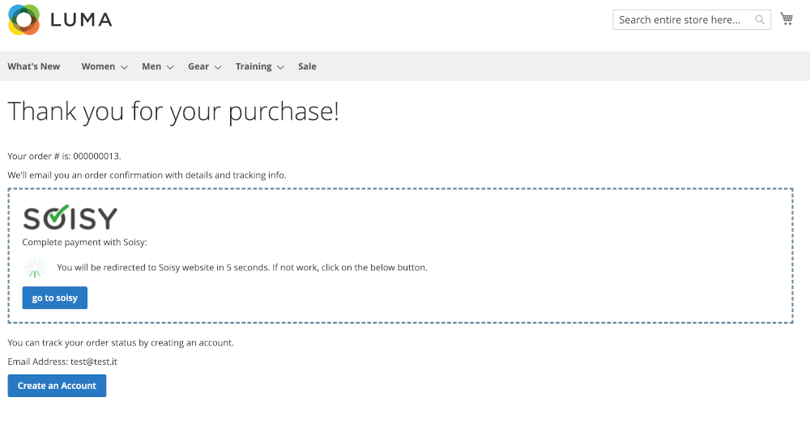
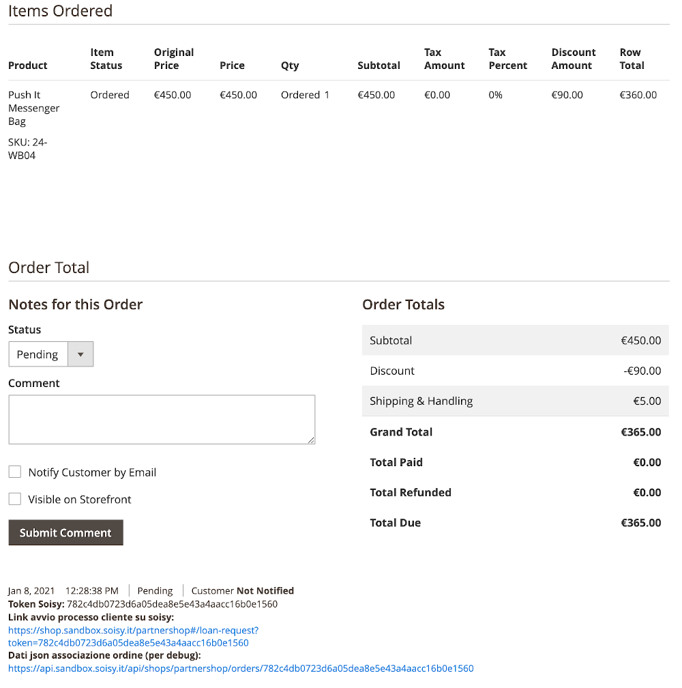

Magento 2 Soisy Payment Extension
=================================
Magento 2.3.x, 2.4.x Soisy's installment payment method

Facts
-----
- version: 1.1.0
- extension key: Soisy_PaymentMethod

Description
-----------
This modules add a new payment method.  

Requirements
------------
- PHP >= 7.2.0

Compatibility
-------------
Tested on:

- Magento  2.3.0 - 2.3.2 - 2.3.4 - 2.3.6 - 2.4.0 - 2.4.1 (with php 7.3)

The module should be compatible also with magento 2 >= 2.3.0

Installation Instructions
-------------------------

### Installation:

1) Manual copy all the files into your magento `root/app/code/Soisy/PaymentMethod`.

    (If you don't have this folder please create it)

2) Clear the cache, logout from the admin panel and then login again.

3) Go to System -> Tools -> Web Setup Wizard, in Module Manager and check "Enable" on Soisy_PaymentMethod.

### Optional: 
Execute the follow command:
1) php bin\magento setup:static-content:deploy -f
2) php bin\magento cache:clean
3) php bin\magento cache:flush

Configuration
-------------
Configure and activate the extension under Stores -> Configuration -> Sales -> Payment Methods

### Sandbox mode

The module just installed is ready for sandbox mode.
To activate set Enable to Yes.

### Production mode

When you are ready for production mode, set "Use In Sandbox" to No and insert production values in fields:
* Shop ID
* Auth Token

Usage
--------------

### User workflow

The customer can see the intalments simulated on the product view page, if the price between settings allowed values:

The customer choose the Soisy payment method:

When the order is placed the user lands on the magento success page. In this page the customer will be redirected to soisy website.

### Admin usage

#### Manage oders

Once the customer place the order the store manager can see some information inside status comments. here the store manager could see the *soisy token* used to map the magento order with Soisy order.  

When Soisy approves an order the store manager should change manually the magento order status from *pending* to *processing*.

## Features not implemented or not tested

* multisite: partially tested;
* multi language: seems ok;
* payment method not visible in admin;
* Status updates via callback backurl: not implemented;

Uninstallation
--------------

* Composer: `composer remove soisy/magento-soisy-payment`
* Modman: `modman remove magento-soisy-payment` (Run `modman list` to be sure the module name is `magento-soisy-payment`)
* Manual: Just remove the module files.

Support
-------
If you have any issues with this extension, open an issue on [GitHub](https://github.com/soisy/Soisy_Payment/issues).

Contribution
------------
Any contribution is highly appreciated. The best way to contribute code is to open a [pull request on GitHub](https://help.github.com/articles/using-pull-requests).

Developer
---------
* [Soisy](http://www.soisy.it)

Copyright
---------
(c) 2022 Soisy
